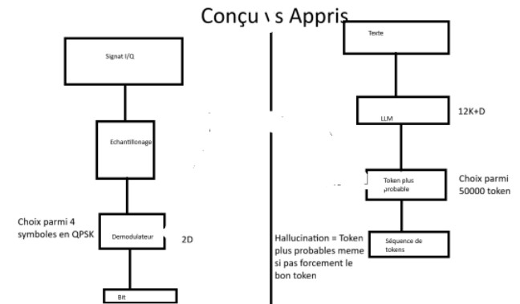

## S1J1 — Comprendre un LLM
   - Définition en 1 phrase : un systeme de prédiction du prochain token. Token: unité atomique manipulée par le LLM ( 3-4 caractere, parfois un mot entier, parfois un fragment.. esemple: manger= 1 token, démoduler= 3 token). Probabilité = détermine le choix d'un token,donc propabilité est différence des token. Le LLM choisit le prochain token selon ces probabilités. LLM se compose de 2 fichiers : fichier parametres ( 140 gb le poids du modele le résultat de l'entrainement / fichier run.c ( 500 lignes de code C ) : programme qui execute le modele. 
   - Analogie RF_LLM (perso) : Imaginé comme un gros démodulateur qui choisis parmi N condidat, le codidat le plus probable.
   - Ce qui me trouble encore : le fonctionnement du neural systeme et le faite qu'on peut juste le calibrer et non pas le comprendre. Si on ne le comprend pas, commet il a ete créé.
- RIR : 3 / Temps : 60 min
## S1J2 — [06/05/2026] — Training, fine-tuning, hallucination

- **Pre-training** (en 1 phrase) : utiliser 10 TB de données internet et les entrainer avec 6000 GPU sur 12 jours, avec un budget de 2 M afin de sortir un packet compréssé de données de taille 140 GB 
  - Coût ordre de grandeur : 6000 GPU, 12 jours, 2 millions $
- **Fine-tuning** (en 1 phrase) : différence avec le pre-training =Des instructions données par des humains afin d'affiner les réponses, et du modele se base sur ces données afin de s'entrainer 
- **Hallucination** (en 1 phrase, vocabulaire RF si possible) : Le LLM se repose sur la probabilité du prochain token, donc il repond avec le token le plus probable meme si c'est pas la bonne réponse ou il dit qu'il ne sais pas. 
vocabulaire RF c'est comme un démodulateur géant qui se base sur N condidat à partir d'un signal(dans ce cas un signal bruit fort )  input afin de sortir un symbolle faux 
- **Analogie RF reprise** : un LLM = démodulateur statistique géant.
  Ma reformulation : c'est comme un démodulateur géant qui se base sur N condidat à partir d'un signal  input afin de sortir un symbolle correct. 

- RIR : 3 / Temps : 40 min
## S1J3 — [06/05/2026] - Schéma RF→LLM

- Idée centrale : Analogie entre démodulateur et LLM . Un LLM decide entre N token dans un espace de representation, comme un Démodulateur. 
- Différence fondamentale RF vs LLM : LLM est similaire à un décodeur en constellllation de 50000 points dans 12000 dimenstions 
- Cas dégradé (hallucination) : Cas de démodulation de fort bruit de signal, donc probabilité de ne pas sortir le symbole correcte
- RIR : 4 / Temps : 60 min
## S1J4 — [07/05/2026] — Feynman : Qu'est-ce qu'un LLM ?
[5 lignes max, sans rouvrir Karpathy ni les sections précédentes]
Un LLM ressemble à un démodulateur géant qui décide parmi N candidats dans un espace appris à 12k+D . C'est un systeme de prédiction du prochain token, composé de 70B de parametres , composé de deux fichiers : un fichier de poids pré entrainés et un fichier run.c. La premiere étape est le pré-entrainement  afin d'entrainer les données internet via 6000 GPU pendant douze  jours pour sortir 140 GB de données compressés. Puis le fine-tunning qui consite à donner des QA par des humains afin de perfectionner les reponses et les donner à LLM pour l'netrainer encore une fois. Il peut faire objet à l'hallucination qui consiste à sortir le prochain token n'est pas un bug mais un mécanisme nominal.
- RIR : 2 / Temps : 90 min
